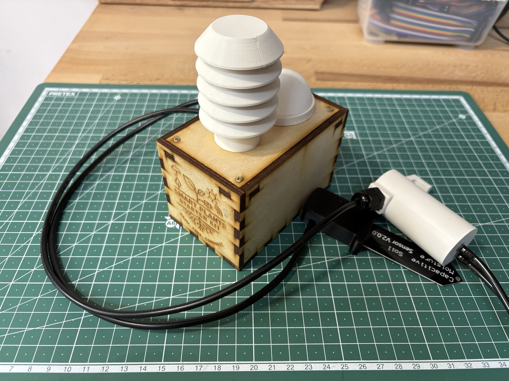
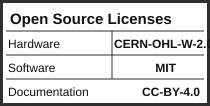

# Smart Plants Starter Kit

A hands-on introduction to building low-power, Wi-Fi-connected plant monitoring systems.
You'll learn the basics of microcontroller programming, soil moisture sensing, and Wi-Fi data
transfer — all while building a device that actually keeps your plants alive.

The device wakes from deep sleep, reads soil moisture (and optionally temperature, humidity,
light, and battery level), sends data to an online dashboard, then sleeps again to conserve
battery.



---

## What You'll Build

By the end of the workshop you'll have a battery-powered soil moisture sensor that:
- Measures soil moisture every hour (configurable)
- Sends data to an online dashboard via Wi-Fi
- Sleeps between measurements to conserve battery
- Waters your plant automatically when the soil gets too dry

No soldering experience required — but you'll get the chance to try!

---

## What's in the Kit

- Waveshare ESP32-C6 Zero microcontroller
- Smart Plants breakout PCB
- Capacitive soil moisture sensor + cable
- BME280 sensor (temperature, humidity, pressure)
- TSL2591 sensor (light)
- Mini diaphragm pump
- Battery pack
- Laser-cut housing
- 3D-printed sensor and pump housings
- Screws, velcro, cable gland

---

## Before You Begin

Make sure you have:
- A computer with a USB-C port (or adapter)
- [Arduino IDE](https://www.arduino.cc/en/software) installed
- A 2.4 GHz Wi-Fi network

Everything else — board support packages, libraries, and configuration — is covered step by
step in the build instructions below.

---

## Build Instructions

**Start here:** [`instructions/build_instructions.md`](instructions/build_instructions.md)

That guide covers the full assembly, programming, calibration, and deployment for the main
Waveshare build — from soldering the PCB to seeing your first readings on the dashboard.

---

## Learning Goals

- Read analog sensor data and convert it to meaningful values
- Understand how to minimise power consumption with deep sleep
- Send data securely to a server over Wi-Fi using HTTP
- Learn how a cloud dashboard receives and displays live sensor readings

---

## Modular Firmware

All features are toggled via flags in `code/sp_modular/config.h`:

```c
#define USE_BME280    1   // temperature, humidity, pressure
#define USE_TSL2591   1   // light sensor
#define USE_PUMP      1   // automatic watering pump
```

Set any flag to `0` to disable that module — no code changes needed elsewhere.

---

## Board Variants

Two controller boards are supported. Both run the same firmware (`code/sp_modular/`).

| Variant | Board | PCB | Who it's for |
|---------|-------|-----|--------------|
| **Main build** | Waveshare ESP32-C6 Zero | `smart_plants_breakout_ws-board_rev2` | Student workshops |
| **Alternative** | SEEED Studio XIAO ESP32-C6 | `smart_plants_breakout_rev1` | Alternative / reference build |

---

## Repository Structure

```
code/
  sp_modular/              Modular firmware (current, for all builds)
    config.h               Feature flags, pin assignments, calibration
    sp_modular.ino         Entry point
    *.ino                  Sensor and actuator modules
  legacy/                  Old monolithic sketches (breadboard era, unsupported)

hardware/
  pcb/
    smart_plants_breakout_ws-board_rev2/   Main build PCB (Waveshare)
    smart_plants_breakout_rev1/            Alternative build PCB (XIAO)
    legacy/                                Older PCB revisions
    ext_files/                             KiCAD footprints and symbols
  3d-print/
    bme_housing/           Miniature Stevenson screen for BME280
    light_sensor/          TSL2591 mount with diffuser
    moisture_sensor/       Soil probe housing
    pump/                  Diaphragm pump enclosure
    cable_plugs/           M12 cable gland plug
  laser_files/
    SmartPlants_4mm_v3.svg Current enclosure template (4 mm material)
    legacy/                Older enclosure versions

instructions/
  build_instructions.md    Main build guide — start here
  background_information.md Sensor theory, system overview, design rationale
  legacy/                  Old breadboard-era guides (unsupported)

img/                       Photos and diagrams referenced by the instructions
```

---

## Background Reading

[`instructions/background_information.md`](instructions/background_information.md) covers:

- **Sensor selection** — why capacitive over resistive moisture sensors, why BME280 and TSL2591
  were chosen over simpler alternatives, and the trade-offs involved
- **Pump control** — how MOSFETs and relays work, and why this design uses an IRLZ14
- **How the system works** — the full data path from firmware wake-up cycle through the FastAPI
  server and PostgreSQL database to the live Grafana dashboard
- **Similar projects** — related open-source plant monitoring builds for further inspiration

Useful context for understanding *why* things are built the way they are.

---

## Licenses

| Component | License |
|-----------|---------|
| Software (`code/`) | [MIT](LICENSE.code) |
| Hardware (`hardware/`) | [CERN-OHL-W 2.0](LICENSE.hardware) |
| Documentation (`instructions/`, `README.md`, `img/`) | [CC-BY 4.0](LICENSE.docs) |



This project is certified open source hardware by OSHWA under certification ID `DE000173`.


