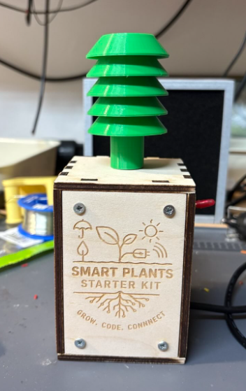

# Smart Plants Starter Kit

This project is a hands-on introduction to building low-power, Wi-Fi-connected plant monitoring systems using the SEEED Studio XIAO ESP32-C6 microcontroller and a simple soil moisture sensor.

Participants will learn the basics of microcontroller programming, moisture sensing, analog-to-digital conversion, and Wi-Fi data transfer – all while building a device that helps monitor plant health in real-time.

---

## 🌱 What You'll Build

By the end of this starter workshop, you'll have a battery-powered soil moisture sensor that:
- Measures soil moisture every few minutes or hours
- Sends the data to an online dashboard via Wi-Fi
- Sleeps in between measurements to conserve energy

No soldering experience required – but you'll have the chance to try!

---

## 🧰 What's in the Starter Kit?

- XIAO ESP32-C6 microcontroller  
- Soil moisture sensor with cable  
- Breadboard and jumper wires  
- Battery case and Schottky diode  
- Laser-cut housing  
- Resistors, screws, Velcro, and more

> 🛠️ Optional extensions like weather sensing (via BME280) or automatic watering (via a pump) are covered in follow-up workshops.

---

## 📝 Build Instructions

Detailed step-by-step assembly, wiring, programming, and calibration instructions are provided here:

📄 [**instructions.md**](./instructions/base_module_batteries.md)

---

## 🔌 Requirements

Before you begin, make sure you have:

- A computer with USB-C port or adapter
- [Arduino IDE](https://www.arduino.cc/en/software) installed
- Board support package for **XIAO ESP32C6**
- A 2.4 GHz Wi-Fi network

---

## 📦 Modular Extensions

You can upgrade your kit over time with additional components and follow-on workshops:

- **BME280 Sensor** – to measure temperature, humidity, and air pressure
- **Pump module** – to enable automated plant watering based on soil data

These modules are not required for the starter project. Maybe we will add more in the future!

---

## 🧪 Learning Goals

- Understand analog sensor readings and voltage mapping  
- Practice safe circuit assembly and sensor calibration  
- Learn how to minimize energy consumption on microcontrollers  
- Send data securely via HTTP using Arduino and the ESP32-C6  

---

## 📷 Example Setup

---

## 📘 License and Reuse

This project uses separate licenses for its different components:

| Component | License |
|-----------|---------|
| Software (`code/`) | [MIT](LICENSE.code) |
| Hardware (`hardware/`, `src/`) | [CERN-OHL-W 2.0](LICENSE.hardware) |
| Documentation (`instructions/`, `README.md`, `img/`) | [CC-BY 4.0](LICENSE.docs) |

---

