# Build Instructions — Waveshare ESP32-C6 Zero + PCB

This guide covers the **main workshop build**: the Waveshare ESP32-C6 Zero on the
`smart_plants_breakout_ws-board_rev2` PCB powered by 3 AA batteries. All sensors (BME280, TSL2591) and the
pump circuit are integrated on the PCB — no breadboard or loose resistors needed.

---

> **Known issue — PCB rev2 silkscreen:** The moisture sensor power connector is labelled
> **"D1-powered"** on the board, but the correct GPIO is **21**. This is a labelling error
> on the PCB and does not affect functionality — just ignore the label and plug the connector
> in as shown in the instructions.

---

## 1. Collect All Parts

Get all parts together before you start. The PCB replaces the breadboard, jumper wires,
and discrete resistors from the old build.

> For a complete itemised parts list (including all PCB components, cables, and quantities),
> see the [Bill of Materials](bom.md) ([CSV version](bom.csv)).

**Electronics**
- Waveshare ESP32-C6 Zero microcontroller
- Smart Plants Breakout PCB (ws-board rev2) + all components
  - 2× 220 kΩ resistor (R1, R2 — battery voltage divider)
  - 1× 10 kΩ resistor (R3 — MOSFET gate pull-down)
  - 1× 22 Ω resistor (R4 — MOSFET gate protection)
  - 2× 4.7 kΩ resistor (R5, R6 — I2C pull-up)
  - 1× 1N4001 diode (D1 — flyback diode)
  - 1× 1N5817 Schottky diode (D2)
  - 1× 220 µF electrolytic capacitor (C2)
  - 1× 22 µF electrolytic capacitor (C3)
  - 1× IRLZ14 MOSFET (Q1)
  - 4× 4-pin JST XH connector (J3, J5, J6, J11 — I2C)
  - 1× 3-pin JST XH connector (J9 — moisture sensor)
  - 2× 2-pin JST XH connector (J7, SW1 — battery / switch)
  - 1× 2-pin JST XH connector (J10 — pump)
  - 1× 2-pin JST PH connector (J4 — USB-C power, 2.0 mm pitch)
  - 2× 9-pin pin socket (J1, J2 — microcontroller socket)
- Capacitive soil moisture sensor + 3-core cable
- BME280 sensor module (temperature, humidity, pressure) + pre-crimped 4-core cable
- TSL2591 sensor module (light) + pre-crimped 4-core cable
- Mini diaphragm pump + 2-core cable
- Battery pack (3× AA)
- USB-C connector with cable
- On/Off Switch

**Mechanical**
- 3D-printed battery housing and PCB mount
- 3D-printed moisture sensor housing + lid
- 3D-printed pump housing
- 3D-printed BME280 housing (Stevenson Screen)
- 3D-printed TSL2591 housing + half ping pong ball as diffusor
- 3D-printed cable plugs (2x)
- Laser-cut enclosure
- 12× wood screws
- Velcro tape
- PG7 cable gland (for pump cable)
- Tubes (pump inlet/outlet)

**Tools**
- Soldering iron + solder
- Crimping tool (for JST connectors)
- Wire cutters / flush cutters
- Wire strippers
- Screwdriver
- Hot-glue gun (or other glue)
- Drill with 8 mm bit (only needed if the housing cable hole is not pre-cut)

---

## 2. Prepare Parts

Several parts need preparation before assembly. These steps can be done in any order —
if a tool you need is in use, move on to another step.

### 2.1 Prepare the PCB

Solder all components on the PCB (suggested order below). Component orientation is indicated by the silkscreen markings. All components but the resistors are orientation sensitive!

| Reference | Component | Qty | Value | Notes |
|-----------|-----------|-----|-------|-------|
| R1, R2 | Resistor | 2 | 220 kΩ | Battery voltage divider |
| R3 | Resistor | 1 | 10 kΩ | MOSFET gate pull-down |
| R4 | Resistor | 1 | 22 Ω | MOSFET gate protection |
| R5, R6 | Resistor | 2 | 4.7 kΩ | I2C pull-up |
| D1 | Diode | 1 | 1N4001 | Flyback diode — stripe (cathode) faces pump + |
| D2 | Diode | 1 | 1N5817 | Schottky diode — stripe (cathode) per silkscreen |
| C2 | Capacitor | 1 | 220 µF | Electrolytic — long leg to + hole |
| C3 | Capacitor | 1 | 22 µF | Electrolytic — long leg to + hole |
| Q1 | MOSFET | 1 | IRLZ14 | Flat side matches silkscreen outline |
| J3, J5, J6, J11 | I2C JST connector | 4 | 4-pin JST XH | |
| J9 | Moisture sensor connector | 1 | 3-pin JST XH | |
| J7, SW1 | Battery / switch connector | 2 | 2-pin JST XH | |
| J10 | Pump connector | 1 | 2-pin JST XH | |
| J4 | USB-C power connector | 1 | 2-pin JST PH | Smaller pitch (2.0 mm) than the XH connectors |
| J1, J2 | Microcontroller socket | 2 | 9-pin pin socket | Solder to PCB; insert the Waveshare board after |

Resistors are not orientation-sensitive. All other components are — match the silkscreen carefully.

Suggested soldering order:
1. Resistors, Diodes
2. JST connectors. Tip: place all connectors, put a paper on it and try to flip the PCB holding all connectors in place with the paper. Solder the connector pins on the back
3. Microcontroller socket
4. Capacitors, Mosfet
5. optional: pin header to expose microcontroller pins

> **First time soldering?** Ask a workshop helper for a quick demo. A cold solder joint here will cause intermittent problems that are hard to debug later.

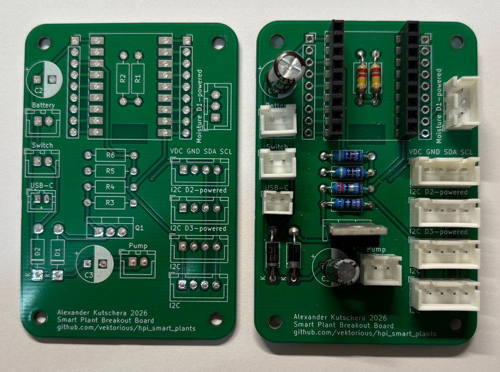

### 2.2 Crimp the Moisture Sensor Cable

The moisture sensor uses a custom cable with a JST connector on either side.

1. Cut the 3-core cable to your preferred length.
2. Crimp **3-pin JST PH** connectors on both ends.
3. Wire order: **GND (black) — VCC (red) — SIGNAL (yellow)** . This must match the sensor
   connector and the PCB header labels.

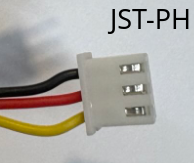

### 2.3 Assemble the Moisture Sensor

1. Discard the short cable that ships with the sensor — use the cable you just crimped.
2. Connect the sensor to the cable.
3. Insert the sensor into the 3D-printed housing and screw on the lid.
4. Push the cable jacket into the housing hole to seal it against dirt and moisture.

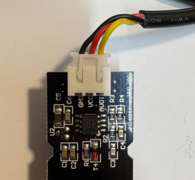 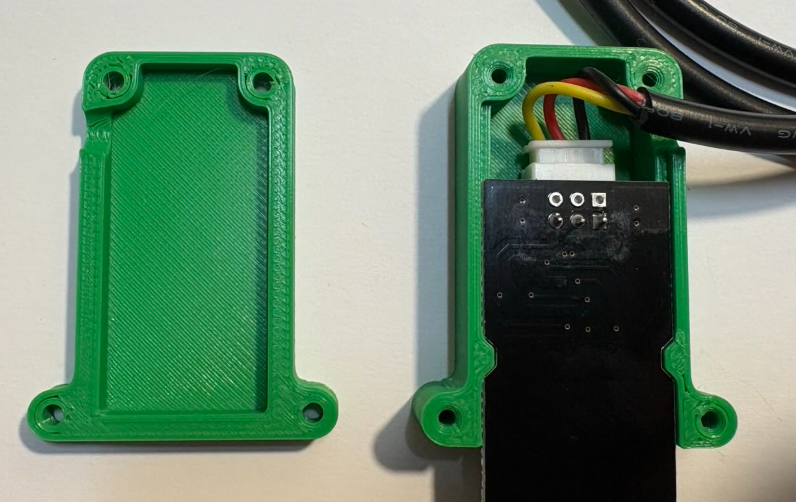 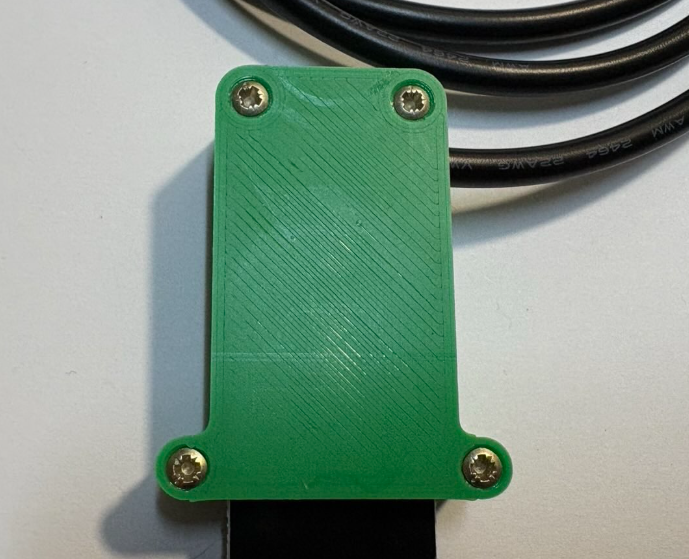

### 2.4 Prepare the Pump

1. Solder a two-core cable to the pump terminals.
2. Insert the pump into the 3D-printed pump housing.
3. Thread the cable through the housing hole, fit the PG7 cable gland, and screw it tight.
4. Crimp a **2-pin JST PH** connector on the free cable end.

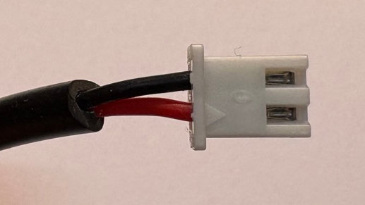 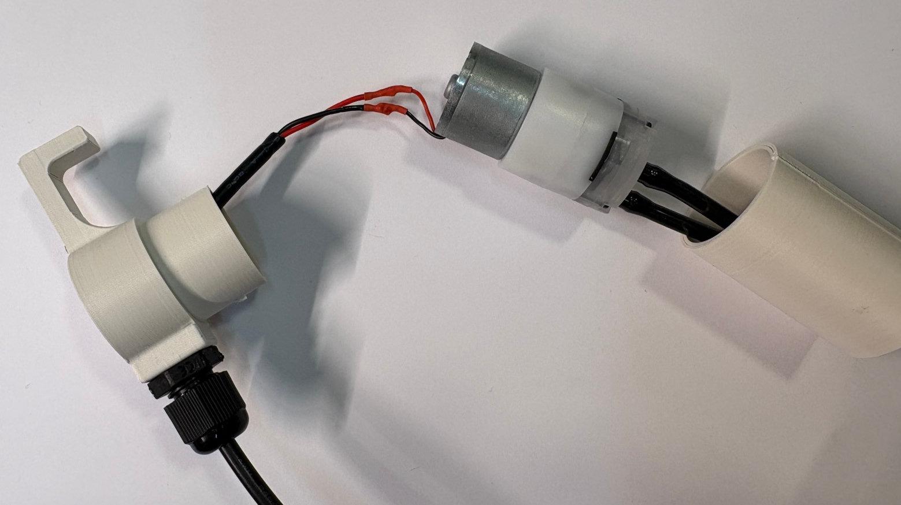

### 2.5 Prepare the BME280 Sensor

1. Solder the pre-crimped cable to the sensor.
2. Wire order: **VCC (black) — GND (red) — SCL (yellow) — SDA (white)**
3. Insert the sensor into the 3D-printed mini Stevenson screen.
4. Thread the cable through the threaded tube and screw it into the Stevenson screen.

> **Note:** The black/red wire colours are swapped relative to convention — black is VCC and red is GND. This is a quirk of the pre-crimped cables. Double-check against the labels above before soldering.

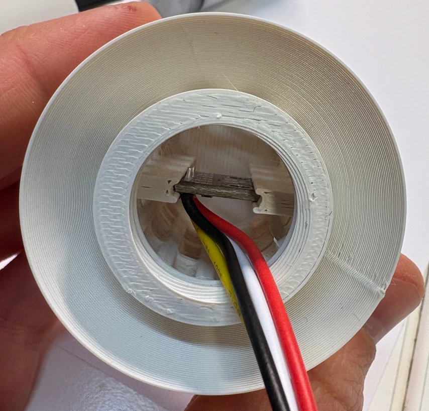 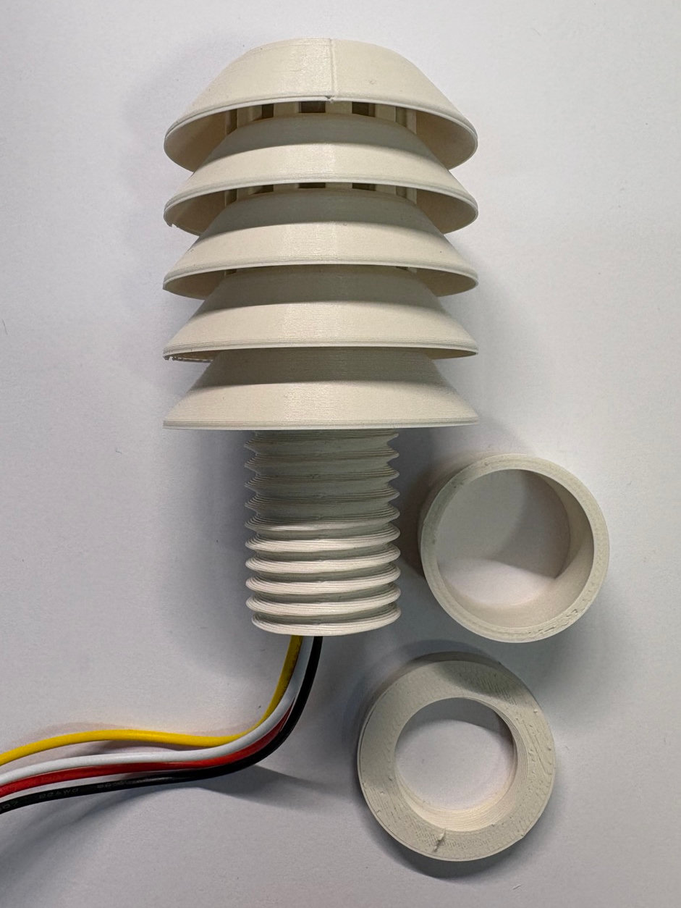

### 2.6 Prepare the TSL2591 Sensor

1. Solder the pre-crimped cable to the sensor. Wires should not be on the sensor side (see pictures).
2. Wire order: **VCC (black) — GND (red) — SCL (yellow) — SDA (white)**
3. Thread the cables through the housing bottom and hot-glue the sensor onto it. The sensor should face upwards.
4. Cut a ping-pong ball in half and glue it onto the sensor housing as a diffuser. It should fit tightly into the groove.

> **Note:** The black/red wire colours are swapped relative to convention — black is VCC and red is GND. This is a quirk of the pre-crimped cables. Double-check against the labels above before soldering.

The ping-pong ball half acts as a diffuser: it scatters incoming light so the sensor measures ambient light from a wide angle rather than a narrow beam from one direction. This makes readings less sensitive to the exact orientation of the housing and reduces the effect of direct sunlight hitting the sensor from a single spot. The same principle is used in professional lux meters and pyranometers.

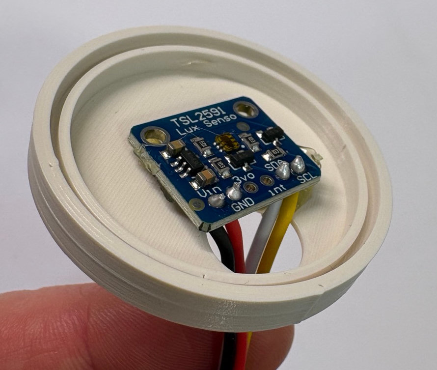 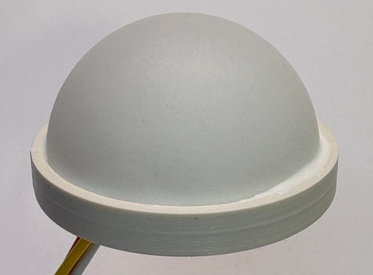

### 2.7 Prepare the Switch

1. Solder two wires to the switch.
2. Add a 2-pin JST XH connector.
3. Wire order does not matter for a switch, but to stay consistent: VCC (black), GND (red).

### 2.8 Prepare the battery pack

1. Add a 2-pin JST XH connector to the battery cables.
2. Wire order: VCC (black), GND (red).

### 2.9 Assemble the Laser-Cut Enclosure

Assemble the housing panels before anything goes inside — it is much harder to add panels
after components are mounted.

1. Slot the side panels together. Add the small corner pieces **while joining the sides**,
   not after — they won't fit in later.
2. If the sensor cable hole is not pre-cut, drill one with an **8 mm bit**. For a tighter
   fit use 5 mm, but you may need to thread the cable before crimping.

---

## 3. Assembly

### 3.1 Mount Sensors to the Lid

1. BME280: slide the distance piece onto the threaded tube, insert it through the hole in the housing lid, and fix it with the locking piece on the other side.
2. Hot-glue the TSL2591 housing to the lid.

> Keep as much distance between the two sensors as possible — the Stevenson screen can otherwise cast a shadow on the TSL2591.

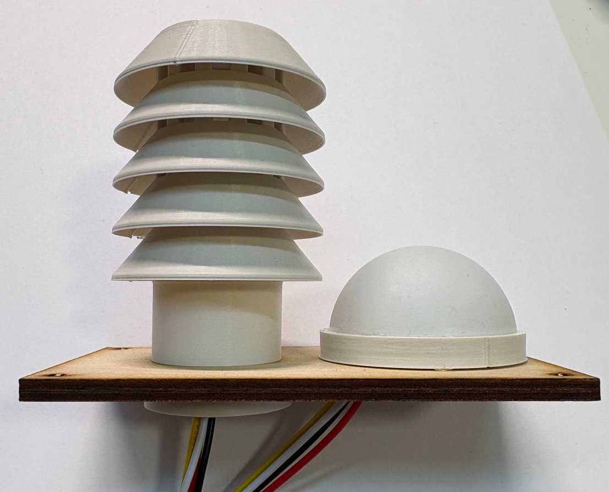

### 3.2 Prepare the Housing

1. Insert the switch into the housing. Make sure it is switched off (flipped to the O-marked side).
2. Insert the USB-C connector into the housing.
3. Feed the pump and moisture sensor cables into the housing.
4. Optional: secure both cables using the 3D-printed cable plugs.

### 3.3 Add the PCB Mount

1. Insert the battery pack into the battery/PCB mount with the switch facing outward.
2. Screw the PCB to the PCB mount.
3. Insert the Waveshare microcontroller into the PCB socket.
4. Attach a small strip of velcro (~2 cm) to the bottom of the PCB mount and a matching strip inside the housing. Keeping it short makes it easier to remove later.
5. You can now fix the battery/PCB mount inside the housing — but wait until after programming. If you position the PCB mount close to the walls, you might be able to access the microcontroller for programming while inside the housing. Just try it. (Section 4).

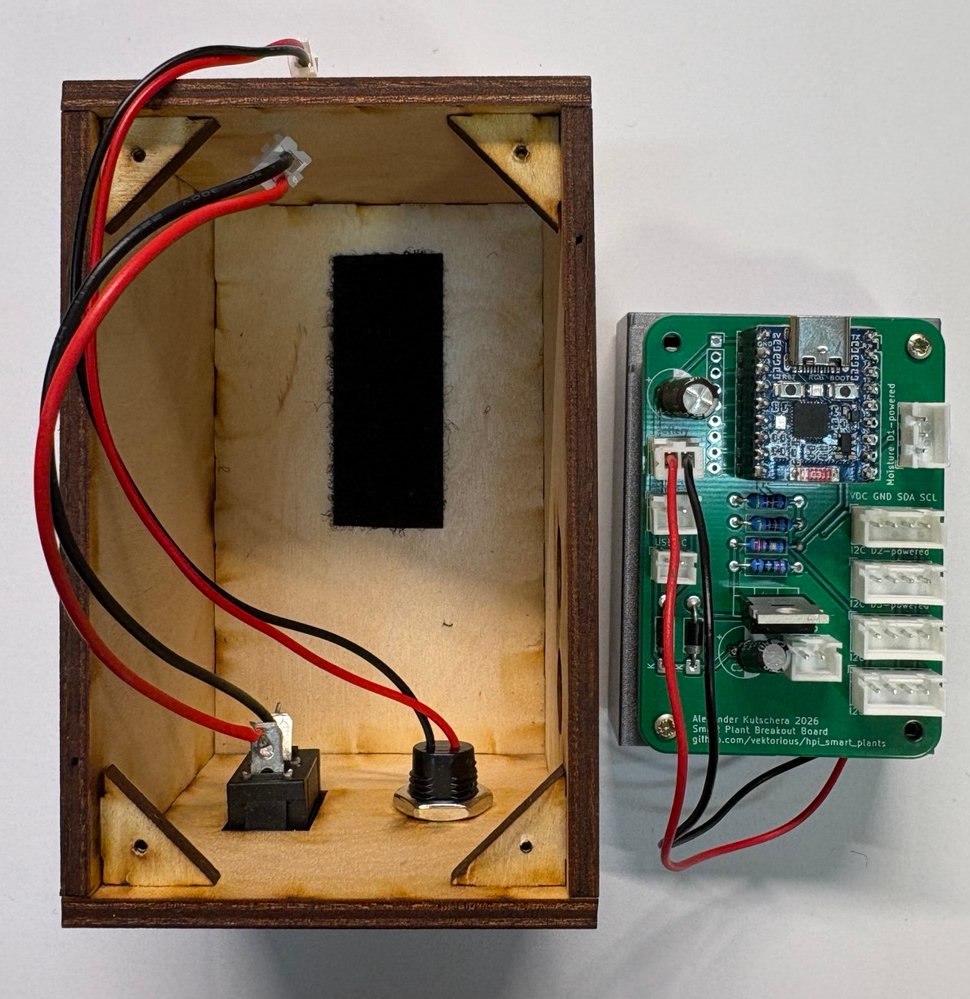

### 3.4 Connect Components to the PCB

The PCB has labelled connectors for every component. Match the connector to its label on
the silkscreen. Connect the BME280 to "I2C D2-powered" and the TSL2591 to "I2C D3-powered".

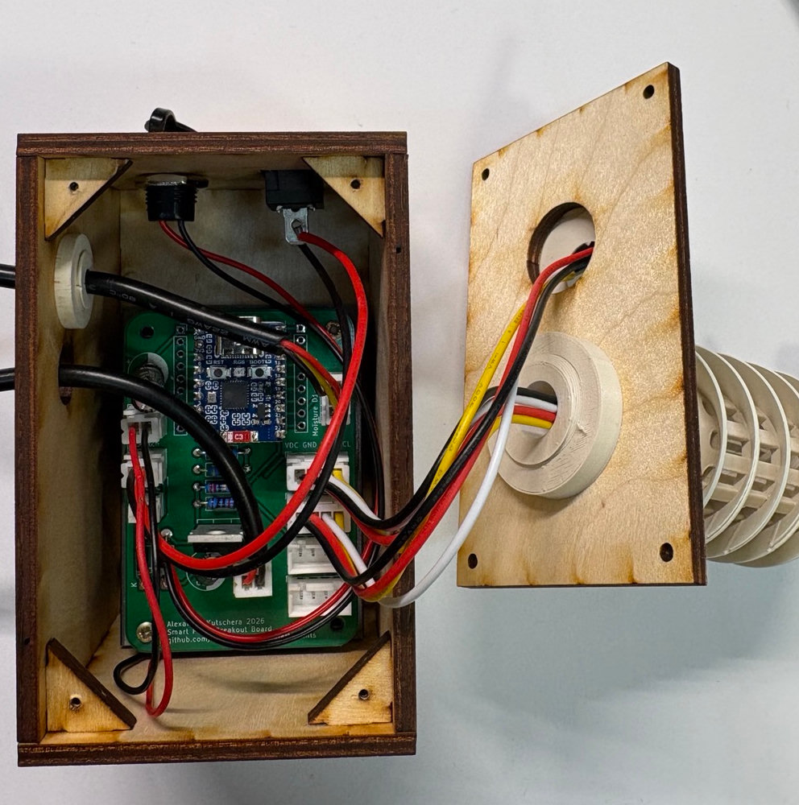

---

## 4. Install & Configure the Firmware

You flash the firmware from your **browser** — no Arduino IDE or drivers needed — then configure
everything (Wi-Fi, sensors, calibration) on the device itself through a setup page. Nothing in the
code needs editing.

> Prefer to build and upload from source (to change the code, or if your browser isn't supported)?
> See [`firmware_from_source.md`](firmware_from_source.md), then come back to
> [4.2 Configure via the setup portal](#42-configure-via-the-setup-portal).

### 4.1 Flash the firmware (web flasher)

You'll need **Chrome, Edge, or Opera** on a desktop computer (Web Serial isn't in Firefox/Safari
or on phones) and a USB-C **data** cable.

1. **Put the board into flashing mode.** The firmware sleeps a few seconds after boot, which
   disconnects the USB port, so start it in its bootloader first:
   1. Unplug the board.
   2. Hold the **BOOT** button.
   3. Plug in the USB-C cable while still holding BOOT.
   4. Release BOOT after ~2 seconds.
2. Open the flasher page: **[plants.makeruniverse.de/flash](https://vektorious.github.io/hpi_smart_plants/)**
   *(https://vektorious.github.io/hpi_smart_plants/)*.
3. Click **Connect**, choose the `USB JTAG/serial debug unit` port, then **Install Smart Plants
   Firmware** and wait for it to finish.
4. The board reboots automatically. Continue below.

### 4.2 Configure via the setup portal

On first boot the device has no Wi-Fi yet, so it opens its own temporary Wi-Fi access point.

1. On your phone or laptop, connect to the network named **`SmartPlant-XXXXXXXX-Setup`**
   (each board has a unique name/ID, so many students can set up side by side without clashing).
   No password required.
2. A setup page opens automatically (if not, browse to `http://192.168.4.1`).
3. Tap **Configure WiFi**, pick your network, and enter the password. You can also set:
   - **Device name** and **UUID** (pre-filled with the board's unique ID — change the name if you
     like something friendlier on the dashboard),
   - which **sensors / pump** are enabled (tick/untick),
   - **sleep interval**, **moisture calibration**, and **pump** thresholds.
   The **API key** is already filled in.
4. **Save.** The device connects to your Wi-Fi and keeps the setup page open so you can check it
   works (next step). The saved-confirmation page links you straight there.

> **Reopen the setup page later** (to change Wi-Fi or settings) by **pressing the reset button
> twice quickly** (a double-press). It also opens automatically whenever the saved Wi-Fi can't be
> found.

### 4.3 Check the sensors and test the connection

From the setup menu, open **Live Sensor Readings**:

- The values **refresh every 10 seconds** — gently breathe on the humidity sensor or shade the
  light sensor and watch them change.
- The **Wi-Fi badge** at the top turns green with your network name and IP once connected.
- If a sensor shows **"not detected"**, its cable or wire order is wrong — re-check the
  colour order from sections 2.5 / 2.6.
- Click **Send to API (test connection)**. A green **✓ 200 OK** confirms the whole chain works
  (Wi-Fi + API key + server). Anything else points at the Wi-Fi or key.

### 4.4 Finish

Click **Finish setup & start monitoring**. The device takes a measurement and begins its normal
cycle: wake every hour, read sensors, send data, sleep. Your device appears on the dashboard at
[plants.makeruniverse.de](https://plants.makeruniverse.de).

---

## 5. Troubleshooting

Most problems can be diagnosed right in the **Live Sensor Readings** page (section 4.3) — no extra
tools needed:

| Symptom | Likely cause / fix |
|---------|--------------------|
| Sensor shows **"not detected"** | Connector not fully seated, or wrong wire order — recheck sections 2.5 / 2.6. |
| **Moisture** stuck near 0 % or 100 % | Sensor cable not seated, or needs calibration (below). |
| **Send to API** not `200` | `Not connected to WiFi` → Wi-Fi wrong; other codes → wrong API key or server issue. |
| Wi-Fi badge stays red | Wrong password, or network out of range / 5 GHz-only (the ESP32-C6 needs 2.4 GHz). |
| No setup AP appears | Board is asleep — press reset twice, or power-cycle, to open the portal. |

### Calibrate the moisture sensor

The moisture-to-percent conversion uses a wet and a dry reference voltage that vary slightly per
sensor. On the **Live Sensor Readings** page, read the **moisture voltage**:

- **In open air** → this is your **dry** voltage (0 %). Enter it as *Moisture dry voltage*.
- **With only the metal prongs in water / saturated soil** → this is your **wet** voltage (100 %).
  Enter it as *Moisture wet voltage*.

Set both in the setup portal (double-press reset to reopen it) and **Save** — no reflash needed.

### Deeper component testing

For standalone test sketches (moisture, pump, I2C bus scan) and Serial-Monitor debugging, see
[`firmware_from_source.md` → Component test sketches](firmware_from_source.md#5-component-test-sketches-advanced-troubleshooting).

---

## 6. Final Test and Deployment

1. With the USB cable still connected, confirm data appears on the dashboard at
   [plants.makeruniverse.de](https://plants.makeruniverse.de).
2. **Disconnect USB** and flip the power switch on.
3. The device should wake, connect to Wi-Fi, send a reading, and go back to sleep.
4. Confirm a new reading appears on the dashboard.

Once confirmed:

5. Fix the PCB mount inside the housing using the velcro strips.
6. Place the moisture sensor cable through the housing hole.
7. Screw on the lid.

> Switching the device off and on again triggers an immediate measurement — useful for
> testing without waiting an hour.

---

## What's Next?

Your device now measures soil moisture, temperature, humidity, light, and battery voltage,
and waters automatically when the soil gets too dry. All readings appear on the dashboard.

For background on how the sensors work and why certain design choices were made, see
[`background_information.md`](background_information.md).
