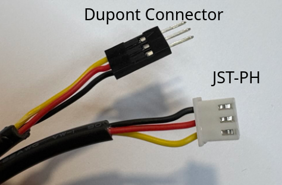
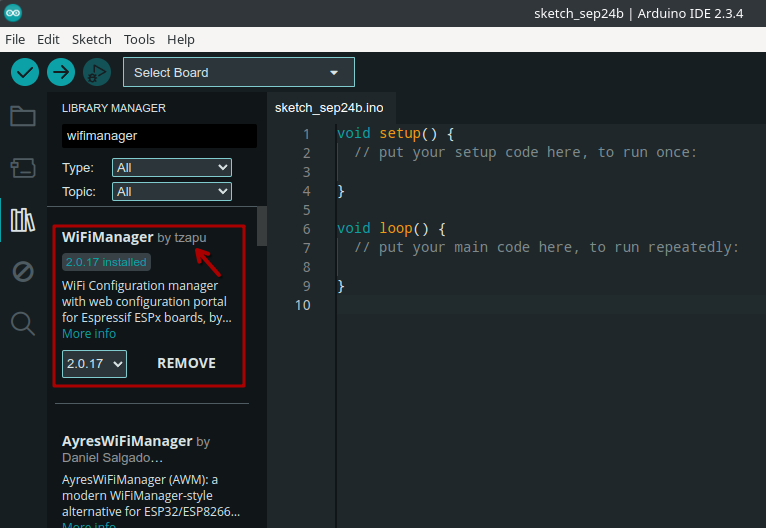

# Build Instructions — Waveshare ESP32-C6 Zero + PCB

This guide covers the **main workshop build**: the Waveshare ESP32-C6 Zero on the
`smart_plants_breakout_ws-board_rev2` PCB. All sensors (BME280, TSL2591) and the
pump circuit are integrated on the PCB — no breadboard or loose resistors needed.

---

## 1. Collect All Parts

Get all parts together before you start. The PCB replaces the breadboard, jumper wires,
and discrete resistors from the old build.

**Electronics**
- Waveshare ESP32-C6 Zero microcontroller
- Smart Plants Breakout PCB (ws-board rev2)
- Capacitive soil moisture sensor with cable
- BME280 sensor module (temperature, humidity, pressure)
- TSL2591 sensor module (light)
- Mini diaphragm pump + 2-core cable
- Battery pack (3× AA or Li-ion, depending on your kit variant)

**Mechanical**
- 3D-printed moisture sensor housing + lid
- 3D-printed pump housing
- Laser-cut enclosure
- 8× wood screws
- Velcro tape
- PG7 cable gland (for pump cable)
- Tubes (pump inlet/outlet)

> **Note:** Your exact kit contents may differ. Check `instructions/full_BOM.ods` for the
> complete bill of materials.

---

## 2. Prepare Parts

Several parts need preparation before assembly. These steps can be done in any order —
if a tool you need is in use, move on to another step.

### 2.1 Solder the Microcontroller to the PCB

The Waveshare ESP32-C6 Zero must be soldered to the pin headers on the PCB.

1. Place the board in the designated footprint on the PCB (component side up, aligned with
   the silkscreen outline).
2. Solder all pins. Work diagonally — tack one corner, then the opposite, then fill in the
   rest to keep the board flat.

> **First time soldering?** Ask a workshop helper for a quick demo. This joint is the most
> important one — a cold joint here will cause intermittent problems.

<!-- TODO: add photo of Waveshare board soldered to PCB -->

### 2.2 Crimp the Sensor Cable

The moisture sensor uses a custom cable with a JST connector on the sensor side and a
Dupont connector on the PCB side.

1. Crimp a **3-pin JST PH** connector on one end.
2. Crimp a **3-pin male Dupont** connector on the other end.
3. Wire order: **VCC (red) — SIGNAL (yellow) — GND (black)**. This must match the sensor
   connector and the PCB header labels.

> **Tip:** If you want the cable to pass tightly through the housing hole, thread the cable
> through the hole *before* crimping the connectors — crimped plugs won't fit through.



### 2.3 Assemble the Moisture Sensor

1. Discard the short cable that ships with the sensor — use the cable you just crimped.
2. Connect the sensor to the cable.
3. Insert the sensor into the 3D-printed housing and screw on the lid.
4. Push the cable jacket into the housing hole to seal it against dirt and moisture.

  

### 2.4 Prepare the Pump

1. Solder a two-core cable to the pump terminals.
2. Insert the pump into the 3D-printed pump housing.
3. Thread the cable through the housing hole, fit the PG7 cable gland, and screw it tight.
4. Crimp a **2-pin Dupont** connector on the free cable end.

### 2.5 Assemble the Laser-Cut Enclosure

Assemble the housing panels before anything goes inside — it is much harder to add panels
after components are mounted.

1. Slot the side panels together. Add the small corner pieces **while joining the sides**,
   not after — they won't fit in later.
2. If the sensor cable hole is not pre-cut, drill one with an **8 mm bit**. For a tighter
   fit use 5 mm, but you may need to thread the cable before crimping.

---

## 3. Connect Components to the PCB

The PCB has labelled connectors for every component. Match the connector to its label on
the silkscreen.

| PCB label | Connect |
|-----------|---------|
| `MOISTURE` | Moisture sensor Dupont connector |
| `PUMP` | Pump Dupont connector |
| `BME280` | BME280 module (I2C header) |
| `TSL2591` | TSL2591 module (I2C header) |
| `BAT` / `POWER` | Battery pack |

> **Before connecting the battery:** complete programming and initial testing first
> (Section 4). Only add the battery in Section 5.

<!-- TODO: add annotated photo of populated PCB with connector labels -->

---

## 4. Program the Microcontroller

### 4.1 Install Arduino IDE and Board Package

If you haven't set up Arduino IDE yet:

1. Download and install [Arduino IDE](https://www.arduino.cc/en/software).
2. Open **File > Preferences** and add this URL to *Additional Boards Manager URLs*:
   `https://dl.espressif.com/dl/package_esp32_index.json`
3. Go to **Tools > Board > Boards Manager**, search for `esp32`, and install the
   **ESP32 by Espressif Systems** package.
4. Select board: **Tools > Board > ESP32 Arduino > Waveshare ESP32-C6-Zero**
   (or search for "ESP32-C6-Zero" in the board list).

### 4.2 Install Required Libraries

In **Tools > Manage Libraries**, search for and install:

| Library | Author |
|---------|--------|
| WiFiManager | tzapu |
| Adafruit BME280 Library | Adafruit |
| Adafruit TSL2591 Library | Adafruit |



### 4.3 Upload the Code

1. Open `code/sp_modular/sp_modular.ino` in Arduino IDE.
2. In `sp_modular.ino`, update the device credentials at the top of the file:

```cpp
const char* DEVICE_NAME = "my-plant";       // choose a unique name
const char* DEVICE_UUID = "00000000";       // 8-character ID from the dashboard
const char* API_KEY     = "vKpsikScqRUt2CdC"; // provided at the workshop
```

3. If you are not using all sensors, open `config.h` and set unused flags to `0`:

```cpp
#define USE_BME280    1   // set to 0 if no BME280 connected
#define USE_TSL2591   1   // set to 0 if no TSL2591 connected
#define USE_PUMP      1   // set to 0 if no pump connected
```

4. Connect the Waveshare board to your computer via USB-C.
5. Select the correct port: **Tools > Port**.
6. Click **Upload**.

> **Upload fails?** The board may be stuck in deep sleep from a previous upload.
> 1. Unplug the board.
> 2. Hold the **BOOT** button.
> 3. Plug back in while holding BOOT.
> 4. Release after 2 seconds, then retry Upload.

### 4.4 Test the Moisture Sensor

Before uploading the final code, verify the sensor works on its own. Copy this sketch into
Arduino IDE, upload it, and open the **Serial Monitor** at 115200 baud:

```cpp
const int moisturePin   = 1;   // A1 on Waveshare
const int moisturePower = 21;  // sensor power gate

const float minMoistureVoltage = 0.60;
const float maxMoistureVoltage = 2.45;

float readMoistureVoltage() {
  uint32_t sum = 0;
  for (int i = 0; i < 16; i++) sum += analogReadMilliVolts(moisturePin);
  return sum / 16.0 / 1000.0;
}

float moistureVoltageToPercent(float v) {
  return constrain((maxMoistureVoltage - v) /
    (maxMoistureVoltage - minMoistureVoltage) * 100.0, 0.0, 100.0);
}

void setup() {
  Serial.begin(115200);
  delay(1000);
}

void loop() {
  pinMode(moisturePower, OUTPUT);
  digitalWrite(moisturePower, HIGH);
  delay(200);

  float v = readMoistureVoltage();
  Serial.printf("Voltage: %.3f V  |  Moisture: %.1f %%\n", v, moistureVoltageToPercent(v));

  digitalWrite(moisturePower, LOW);
  delay(5000);
}
```

You should see readings every 5 seconds. The voltage decreases as the soil gets wetter.

### 4.5 Calibrate the Moisture Sensor (recommended)

The voltage-to-percentage conversion uses two reference points that vary slightly between
sensors. Calibrating yours improves accuracy.

**Dry measurement (0% moisture):**
1. Hold the sensor in open air.
2. Note the voltage from the Serial Monitor — this is your `MAX_MOIST_V`.

**Wet measurement (100% moisture):**
1. Insert only the metal prongs into water or saturated soil.
2. Note the voltage — this is your `MIN_MOIST_V`.

Update `code/sp_modular/config.h` with your measured values:

```cpp
#define MIN_MOIST_V   0.60f  // your wet voltage
#define MAX_MOIST_V   2.45f  // your dry voltage
```

### 4.6 Connect to Wi-Fi

The firmware uses WiFiManager. On first boot (or when no saved network is found):

1. The device starts a temporary Wi-Fi access point named **`DEVICE_NAME-Setup`**.
2. Connect to it from your phone or laptop.
3. A configuration page opens — enter your Wi-Fi credentials.
4. The device connects, saves the credentials, and starts measuring.

From the next boot onward it connects automatically. You can see your device appear on the
dashboard at [plants.makeruniverse.de](https://plants.makeruniverse.de).

> **Tip:** For battery-powered operation, keep `TIME_TO_SLEEP_SEC` at 3600 (1 hour).
> This balances data resolution with battery life.

---

## 5. Final Test and Assembly

1. With the USB cable still connected, confirm data appears on the dashboard.
2. **Disconnect USB**, then connect the battery pack to the PCB battery connector.
3. The device should wake, connect to Wi-Fi, send a reading, and go back to sleep.
4. Confirm a new reading appears on the dashboard.

Once confirmed:

5. Mount the PCB in the housing. Use velcro or the mounting holes on the PCB.
6. Attach the battery pack inside the housing with velcro.
7. Route the sensor cable through the housing hole.
8. Screw on the lid.

> The device measures every time it wakes from sleep. Switching power off and on triggers
> an immediate measurement — useful for testing without waiting an hour.

---

## What's Next?

The base module measures **soil moisture** and **battery voltage**. If your kit includes
additional sensors or a pump, they are already wired on the PCB and activated in firmware
by default. No additional wiring is needed — just confirm the corresponding feature flags
in `config.h` are set to `1`.

For background on how the sensors work and why certain design choices were made, see
[`instructions/background_information.md`](background_information.md).
