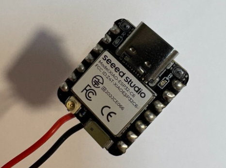
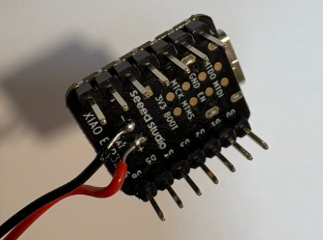
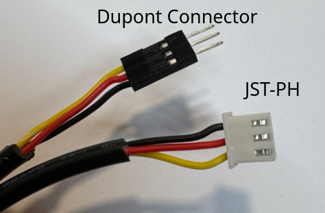
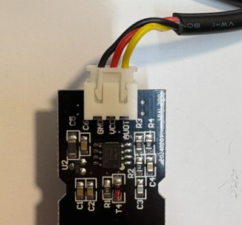
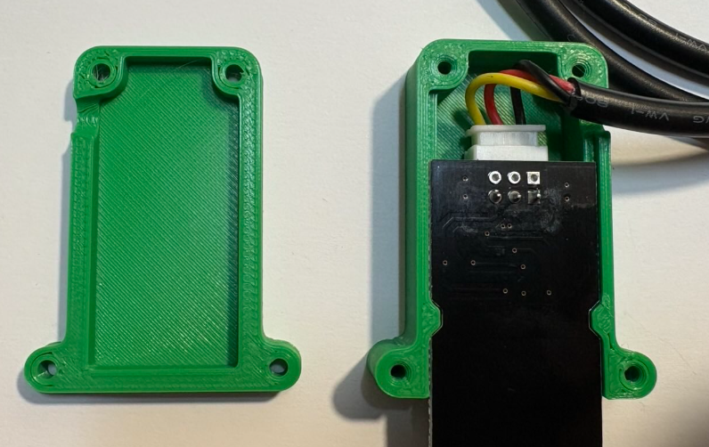
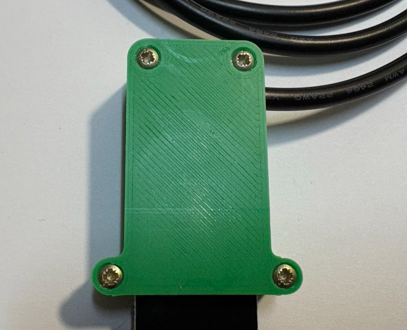
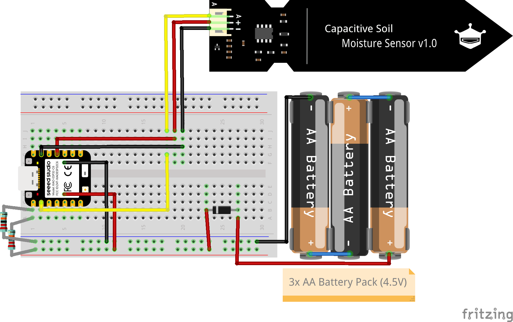
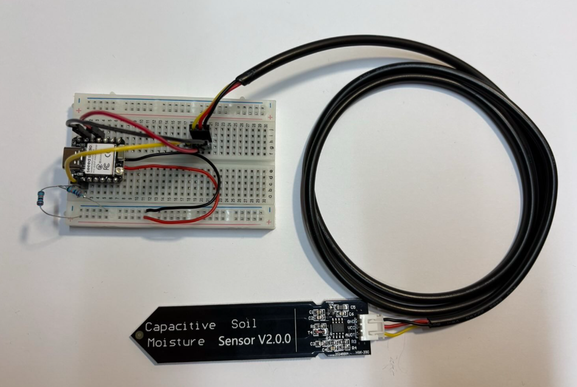
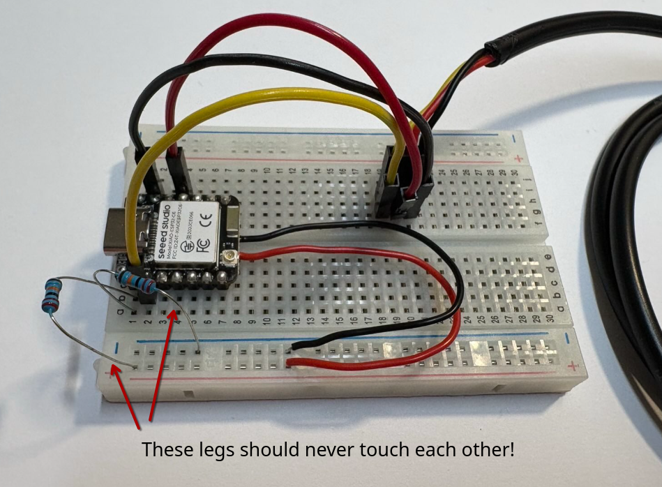
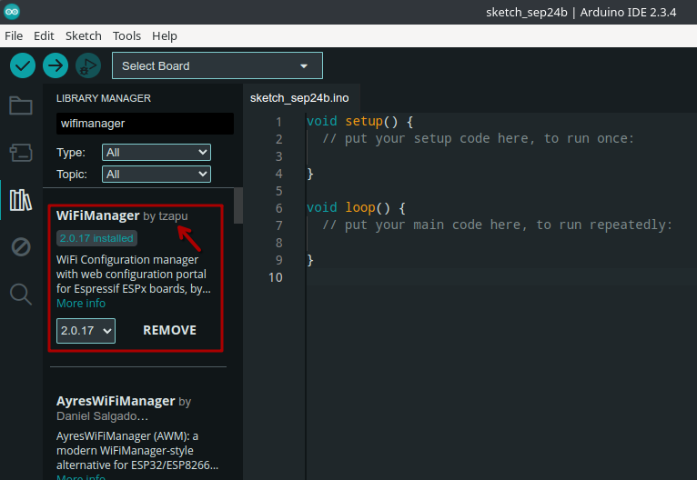

# Build Instructions
## 1. Collect All Parts
At the beginning get all the necessary parts together. 

**List of parts**
- Breadboard
- XIAO ESP32C6 Microcontroller
- Battery Case
- 3x AA Batteries
- Schottky Diode
- Moisture Sensor
- Sensor Cable
- Sensor Housing
- 3x Jumper Cable
- 2x 220k Ohm Resistors
- laser-cut Housing
- 8x Wood Screws
- Velcro Tape

## 2. Prepare Parts
Some parts have to be prepared (soldered/crimped/glued). You have the option to get them pre-prepared from us if you feel unconfortable using the tools but you are encouraged to try even if you never used them before!

Obviously all preparation don't have to be done in an particular order. So if you see that some tools are in use that you need, just do some other preparation.

**Solder Microcontroller (skip if in the workshop)**\
Solder the pin header to the microcontroller and add wires to the battery pads.

 

**Crimp Cable (skip if in the workshop)**\
Crimp one 3-pin JST (PH) connector on one side of the cable and a 3-pin male Dupont connector on the other. Make sure the wires follow the correct order: VCC (red), SIGNAL (yellow), GND (black). If you want the cable to fit tightly through the hole in the housing, feed the cable through the hole before crimping the connector, as crimped plugs won’t fit through small openings.



**Prepare Sensor**\
_Discard the cable that comes with the sensor_ (give it to us). Connect the sensor with the longer round cable you just prepared. Put the sensor into the 3D-printed housing and screw it together. We recommend to push the black isolation of the cable into the housing hole so it seals it tightly.

  

**Prepare the Housing (skip if in the workshop and do it home or after everything else is done)**\
Assemble the laser-cut housing. Drill a hole into one wall for the sensor cable. Use a 8mm drill for the hole. If you want to have the cable fit very tightly in the hole, you can use a 5mm drill but you might need to remove the connector end of the cable to fit it through (or put it through the hole before crimping).

⚠️ Important: Add the corners NOT at the end. Add them while you are connecting the sides. Otherwise you won't be able to fit them in there!

## 3. Assemble the Circuit
Add all parts to the breadboard as shown in the circuit below.


XIAO ESP32C6 Pinout
 


⚠️ Important: Do not connect the battery pack yet. We’ll add it only after programming and testing to avoid accidental powering.

Here are all the connections written out:

Moisture Sensor:
- Signal pin (yellow cable) to board pin A1
- Vcc pin (power, red cable) to board pin D10
- GND pin (ground, black cable) to board GND

Microcontroller:
- Battery Pad + to the + rail in the breadboard
- Battery Pad - to the - rail in the breadboard
- Connect pin A0 to the + and - rail with a 220k Ohm Resistor (voltage divider). Be careful, the legs of the resistor on the rail side should not touch.

We will connect the battery pack through the Schottky diode in the last steps.

It should look like this in the end:




## 4. Program the Microcontroller
### 4.1 Preparations
You should already have the Arduino IDE with the respective board libraries set up. If not, check out these [instructions](https://wiki.seeedstudio.com/xiao_esp32c6_getting_started/#software-preparation).

### 4.2 Install the WiFiManager Library
You still need to install the WiFiManager libary. In the Arduino IDE select Tools > Manage Libraries. In the search bar enter "wifimanager" and install the library from "tzapu" (see below).



### 4.3 How to upload code to the Microcontroller
Here are the general steps to upload a programm to your microcontroller:
1. Connect your _XIAO ESP32-C6_ to your computer via USB
2. In the Arduino IDE:
    - Select the correct board under Tools > Board (the correct board is "XIAO_ESP32-C6")
    - Select the correct port under Tools > Port (this is usually already preselected)
3. Click the Upload button

⚠️ If the upload fails because the device is in deep sleep (only if you have programmed it before):

1. Unplug the board
2. Hold the BOOT button
3. Plug it back in while still holding BOOT
4. Release the button after 2 seconds
5. Try uploading again

### 4.4 Test Moisture Sensor
Copy this script into your Arduino IDE and flash the ESP with it. You should see output in the Serial Monitor (if not active yet, Tools>Serial Monitor)

Note: Make sure the sensor cable is fully plugged in and the metal prongs of the sensor are not touching each other. Readings may be unstable if the power to the sensor is not reliable.

```cpp
const int moisturePin = A1;
const int moisturePower = D10;

const float minMoistureVoltage = 0.5;
const float maxMoistureVoltage = 2.5;

float readMoistureVoltage() {
  uint32_t sum = 0;
  for (int i = 0; i < 16; i++) {
    sum += analogReadMilliVolts(moisturePin);
  }
  return sum / 16.0 / 1000.0;
}

float moistureVoltageToPercent(float voltage) {
  float percent = (maxMoistureVoltage - voltage) / (maxMoistureVoltage - minMoistureVoltage) * 100.0;
  return constrain(percent, 0.0, 100.0);
}

void setup() {
  Serial.begin(115200);
  delay(1000);
  Serial.println("Moisture Sensor Test");
  Serial.println();
}

void loop() {
  pinMode(moisturePower, OUTPUT);
  digitalWrite(moisturePower, HIGH);
  delay(200);  // sensor warm-up time

  float moistureVoltage = readMoistureVoltage();
  float moisturePercent = moistureVoltageToPercent(moistureVoltage);

  digitalWrite(moisturePower, LOW);

  Serial.println("Sensor Reading:");
  Serial.println("---------------------------");
  Serial.printf("Moisture Voltage : %.3f V\n", moistureVoltage);
  Serial.printf("Moisture Percent : %.1f %%\n", moisturePercent);
  Serial.println("---------------------------\n");

  delay(5000);  // wait 5 seconds
}

```

### 4.5 Moisture Sensor Calibration (skip if in the workshop)

The moisture sensor gives you a voltage that decreases as moisture increases. To convert this into a percentage, you need to define two reference points:

- Dry: The voltage when the sensor is in air or dry soil (corresponds to 0%).
- Wet: The voltage when the sensor is in water or fully saturated soil (corresponds to 100%).

These voltages vary slightly between sensors, so calibrating each one improves accuracy.

Steps:
Dry measurement:

- Leave the sensor in air.
- Wait a few seconds and note the voltage value printed to the Serial Monitor.
- This is your maximum voltage (corresponds to 0% moisture).

Wet measurement:

- Insert the sensor tips into very wet soil or a glass of water (only the metal part).
- Wait a few seconds and note the voltage value.
- This is your minimum voltage (corresponds to 100% moisture).

Update your code:

Set the minMoistureVoltage and maxMoistureVoltage constants in your code to match the measured values:

```cpp
const float minMoistureVoltage = 0.5;
const float maxMoistureVoltage = 2.5;

```
Note: Use these values in the final code as well!

### 4.6 Upload Final Script
Download or copy the final code from this repository.

Before uploading the final code, open the sketch in Arduino IDE and scroll to the "USER SETTINGS" section at the top. Adjust the following values to match your setup:

```cpp
#include <WiFi.h>
#include <HTTPClient.h>
#include <WiFiManager.h>  // https://github.com/tzapu/WiFiManager

// ================= USER SETTINGS =================

// Device identification
// Choose a unique name and short ID for your device
// You can use an UUID generator and just use the first part (8 symbols) of the generated ID
// https://www.uuidgenerator.net/version4
const char* deviceName = "Maker Universe";
const char* deviceUUID = "22593b21";

// API endpoint
const char* apiUrl  = "https://plants.makeruniverse.de/plants/measurements";
const char* apiKey  = "vKpsikScqRUt2CdC";

// Moisture sensor calibration
// Measure voltage when sensor is in water (100%) and dry soil or air (0%)
const float minMoistureVoltage = 0.60;
const float maxMoistureVoltage = 2.45;

// Battery voltage divider ratio
// Only change this if you are using a different resistor setup
const float batteryDividerRatio = 2.0;

// Measurement interval (in seconds)
// 300 = 5 minutes, 3600 = 1 hour
// Measuring every hour is recommended for longer battery life
#define TIME_TO_SLEEP 3600 

// ================= PIN CONFIG ====================
const int moisturePin     = A1;
const int batteryPin      = A0;
const int sensorPowerPin  = D10;


#define uS_TO_S_FACTOR 1000000ULL
RTC_DATA_ATTR int bootCount = 0;

/// ========== FUNCTIONS ==========

void printWakeupReason() {
  esp_sleep_wakeup_cause_t reason = esp_sleep_get_wakeup_cause();
  switch (reason) {
    case ESP_SLEEP_WAKEUP_TIMER:
      Serial.println("Wakeup: Timer");
      break;
    default:
      Serial.printf("Wakeup not from timer: %d\n", reason);
      break;
  }
}

void setupWiFi() {
  WiFi.mode(WIFI_STA);
  WiFi.begin();

  Serial.print("Connecting to Wi-Fi");
  int retries = 0;
  while (WiFi.status() != WL_CONNECTED && retries < 20) {
    delay(500);
    Serial.print(".");
    retries++;
  }
  Serial.println();

  if (WiFi.status() == WL_CONNECTED) {
    Serial.println("Wi-Fi connected: " + WiFi.localIP().toString());
    return;
  }

  Serial.println("Wi-Fi failed. Starting WiFiManager...");
  WiFiManager wm;
  String apName = "SmartPlant-Setup-" + String(deviceName);
  wm.setConfigPortalTimeout(120);  // 2 min timeout
  if (!wm.autoConnect(apName.c_str())) {
    Serial.println("WiFiManager failed or timed out. Sleeping...");
    shutdownAndSleep();
  }
}

float readBatteryVoltage() {
  analogRead(batteryPin);
  delay(50);
  uint32_t Vbatt = 0;
  for (int i = 0; i < 16; i++) {
    Vbatt += analogReadMilliVolts(batteryPin);
  }
  return batteryDividerRatio * Vbatt / 16 / 1000.0;
}

float readMoistureVoltage() {
  delay(50);
  uint32_t Vraw = 0;
  for (int i = 0; i < 16; i++) {
    Vraw += analogReadMilliVolts(moisturePin);
  }
  return Vraw / 16.0 / 1000.0;
}

float moistureVoltageToPercent(float voltage) {
  float percent = (maxMoistureVoltage - voltage) / (maxMoistureVoltage - minMoistureVoltage) * 100.0;
  return constrain(percent, 0.0, 100.0);
}

void sendData(float moistureVoltage, float moisturePercent, float batteryVoltage) {
  if (WiFi.status() == WL_CONNECTED) {
    HTTPClient http;
    http.begin(apiUrl);
    http.addHeader("Content-Type", "application/json");
    http.addHeader("x-api-key", apiKey);

    String json = "{";
    json += "\"name\": \"" + String(deviceName) + "\",";
    json += "\"device_uuid\": \"" + String(deviceUUID) + "\",";
    json += "\"sensors\": {";
    json += "\"moisture_voltage\": {\"value\": " + String(moistureVoltage, 3) + ", \"unit\": \"V\"},";
    json += "\"moisture\": {\"value\": " + String(moisturePercent, 1) + ", \"unit\": \"%\"},";
    json += "\"battery_voltage\": {\"value\": " + String(batteryVoltage, 2) + ", \"unit\": \"V\"}";
    json += "}}";

    int httpResponseCode = http.POST(json);
    Serial.println("POST response code: " + String(httpResponseCode));
    Serial.println("Payload: " + json);
    http.end();
  } else {
    Serial.println("WiFi not connected, skipping data send.");
  }
}

void shutdownAndSleep() {
  digitalWrite(sensorPowerPin, LOW);
  WiFi.disconnect(true);
  WiFi.mode(WIFI_OFF);
  delay(200);
  Serial.flush();
  Serial.end();
  esp_sleep_enable_timer_wakeup(TIME_TO_SLEEP * uS_TO_S_FACTOR);
  esp_deep_sleep_start();
}

// ========== MAIN ==========

void setup() {
  Serial.begin(115200);
  delay(1000);

  ++bootCount;
  Serial.println("Boot #" + String(bootCount));
  printWakeupReason();

  setupWiFi();

  pinMode(sensorPowerPin, OUTPUT);
  digitalWrite(sensorPowerPin, HIGH);
  delay(200);
  float moistureVoltage = readMoistureVoltage();
  float moisturePercent = moistureVoltageToPercent(moistureVoltage);
  digitalWrite(sensorPowerPin, LOW);

  float batteryVoltage = readBatteryVoltage();

  Serial.println("Moisture voltage: " + String(moistureVoltage, 3) + " V");
  Serial.println("Moisture percent: " + String(moisturePercent, 1) + " %");
  Serial.println("Battery voltage: " + String(batteryVoltage, 2) + " V");

  sendData(moistureVoltage, moisturePercent, batteryVoltage);
  shutdownAndSleep();
}

void loop() {
  // Nothing here
}

```

### 4.7 How to Use the Sensor
This project uses WiFiManager, a user-friendly tool that allows the device to connect to a Wi-Fi network without hardcoded credentials. When powered on for the first time (or if no connection can be established), the device automatically starts a temporary Wi-Fi access point for 2 minutes, where users can enter their home Wi-Fi details via a web interface. After configuration, the device connects automatically in future sessions without needing to re-enter the credentials. You can always re-trigger the launch of the access point by switching the device off and on again.

Upload the code, look out for a Wi-Fi access point named "SmartPlant-Setup-DEVICE_NAME". Connect to it and enter the Wifi credentials. Now monitor the dashboard at ([plants.makeruniverse.de](plants.makeruniverse.de). You should see your plant/device coming up soon! If that worked, you are ready for the final Assembly.

Tip: For battery-powered operation, it's best to set the sleep time to 3600 seconds (1 hour). This gives you a good balance between data frequency and battery life.

## 5.Final Test and Assembly

Unplug the Microcontroller and add the battery pack to the circuit (keep it switched off first). Connect the - of the battery pack to the - rail. Connect  the + of the pack to the + rail through the Schottky diode. The diode protects the batteries. Take a close look at the orientation of the diode!

If everything is connected correctly (double check) and no USB is connected to the microcontroller, flip the switch of the battery pack and watch for your data coming in on the dashboard.

If that worked, you are ready for putting everything into the housing. Switch off the battery pack first! I recommend gluing the the breadboard to the back of the housing by removing parts of the cover of the tape on the back of it. Add the velco tape to the battery pack and the inner side of the housing lid so it can be attached there. Before you screw on the lid, switch on the battery pack again. 

⚠️ Note: Switching the battery off and on again, re-triggers a measurement. If there is a Wifi connection, you should see the values appearing on the dashboard. 


